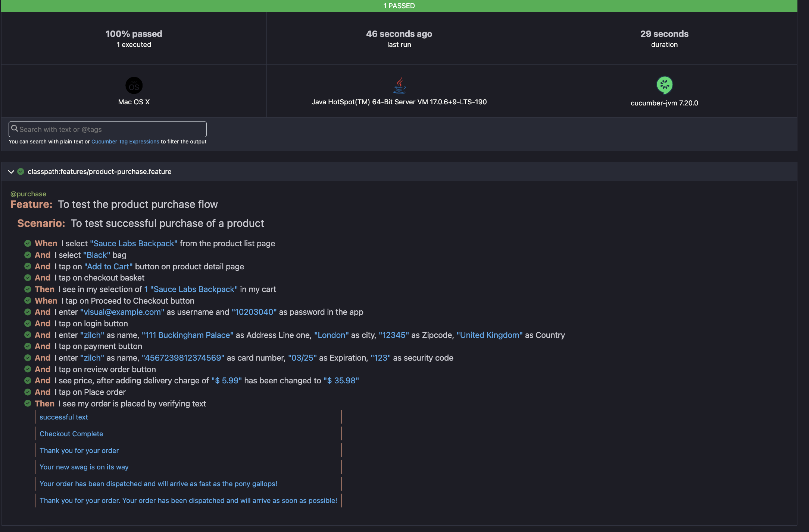
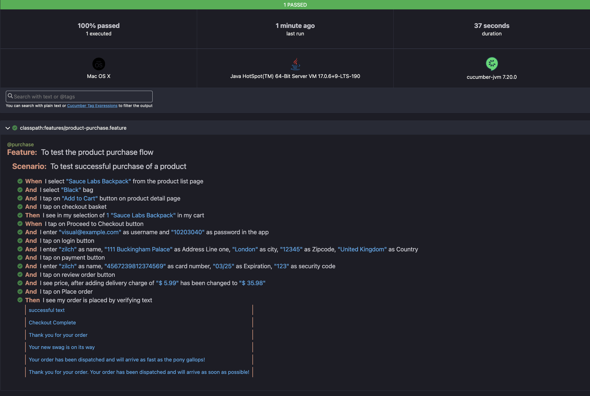

# My Demo App Mobile Automation

"My Demo App" is a sample e-commerce application available for both Android and iOS platforms. Users can browse and purchase clothing items by placing orders. This `README.md` outlines the mobile automation framework created to test the purchase flow within the app.

## About the Testing Framework

This mobile testing framework is developed using **Appium** for automated testing on Android emulators and iOS simulators. The framework supports the execution of end-to-end purchase flow tests, ensuring app functionality across different mobile platforms.

### Key Features:

- **Cross-Platform Support**: Runs seamlessly on both Android (Pixel 7 Pro emulator) and iOS (iPhone 16 Pro simulator).
- **Cucumber Integration**: Test scenarios are defined in a BDD format for better readability and collaboration.
- **Customizable Test Execution**: Easily adaptable to different devices by modifying configuration files.

## Technology Stack

This project leverages the following technologies:

- **Appium**: A cross-platform mobile application automation tool.
- **Java**: The primary programming language for implementing test logic.
- **Cucumber**: Facilitates BDD-style test writing.
- **jUnit**: The test runner for executing test cases.
- **Maven**: Manages project dependencies and builds.

## Prerequisites for Running the Test Scenarios

### Installation Requirements

Ensure the following are installed on your system:

1. **Appium** (version 2.12.1)
2. **Java Development Kit** (version 17+)
3. **Android Studio** for running the Android emulator (Android Studio Giraffe Patch 2)
4. **Xcode** for running the iOS simulator (version 16.1)

### Configurations

If you plan to use the default emulators (Pixel 7 Pro for Android and iPhone 16 Pro for iOS), no configuration changes are needed. Otherwise, follow these steps:

1. Open the configuration file located at:
   ```
   src/test/resources/config/mobile_capabilities.yml
   ```
2. Update the `deviceName` and `platformVersion` fields with the details of the emulator/simulator you intend to use.

## Running the Test Cases

To execute the tests, follow these steps:

### Step 1: Install Dependencies

Download all required dependencies using the following command:
```
mvn clean install -DskipTests
```

### Step 2: Execute Tests on Android Emulator

Run the tests using:
```
mvn test -Dplatform=android
```

### Step 3: Execute Tests on iOS Simulator

Run the tests using:
```
mvn test -Dplatform=ios
```

## Test Reports

Generated reports can be found at:
```
target/cucumber-reports/Cucumber.html
```

### Viewing the Test Reports

To open the generated test report:

1. Navigate to the `target/cucumber-reports` folder.
2. Locate the `Cucumber.html` file.
3. Right-click on the `html` file and select `Open with` -> choose your browser.
4. Sample reports are attached below -
   1. Android
      
   2. iOS
      
5. Sample recording can be found below -
   1. iOS - src/test/resources/test-results/ios-recording.mov
   2. Android - src/test/resources/test-results/android-recording.mov

## Project Structure Overview

- **src/test/java**: Contains Java-based test scripts integrated with Appium and Cucumber.
- **src/test/resources**: Stores the Cucumber feature files and configuration files.
- **src/test/resources/config**: Contains `mobile_capabilities.yml` for device-specific configurations.
- **pom.xml**: The Maven configuration file managing dependencies and build plugins.

## Sample Test Scenario

The framework currently runs one happy path scenario for the purchase journey (`product-purchase.feature`). Additional scenarios in other feature files can be implemented using a similar approach.

## Future Enhancements
- **CI/CD Integration**: Automate test runs using tools such as **Jenkins** or **GitHub Actions** for continuous delivery.